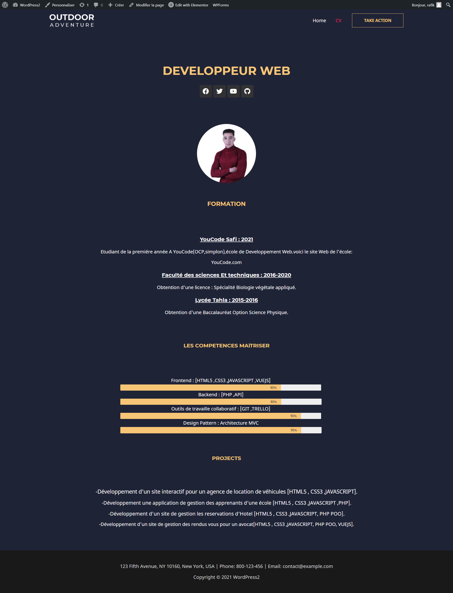

# Brief-7
Creation d'un Portfolio Avec WordPress 

1-Installation de Wordpress sur: https://wordpress.org/download/

2- la prmiere étape c'est l création d'une base de donnée 

3-Installation du Worpress au localhost.

4-Configuration de username et password de votre site Wordpress.

5-Téléchargement du plugin ELEMENTOR

6-Importaion Astra(Theme), aprés j'ai pris a travaillée sur un demo d'un portfolio.

7-Modification du demo avec Elementor.

7-Creation des utilisateur.

